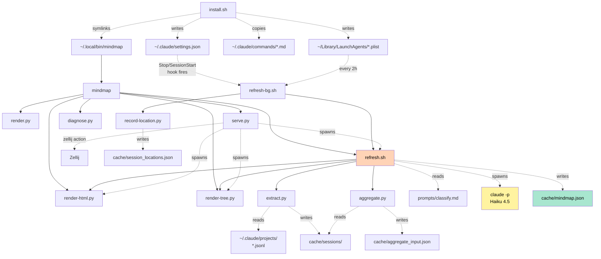
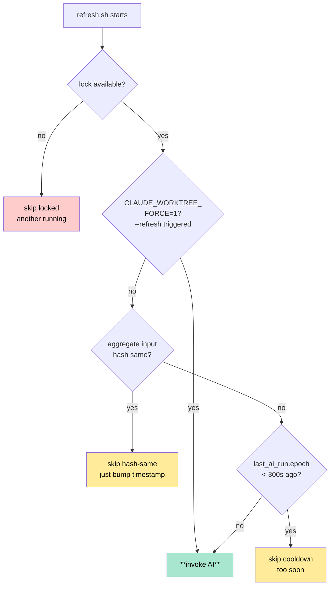
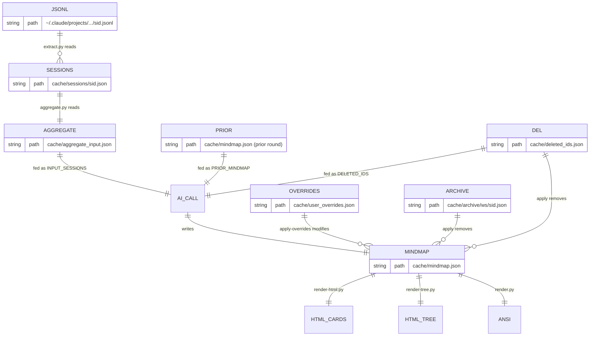
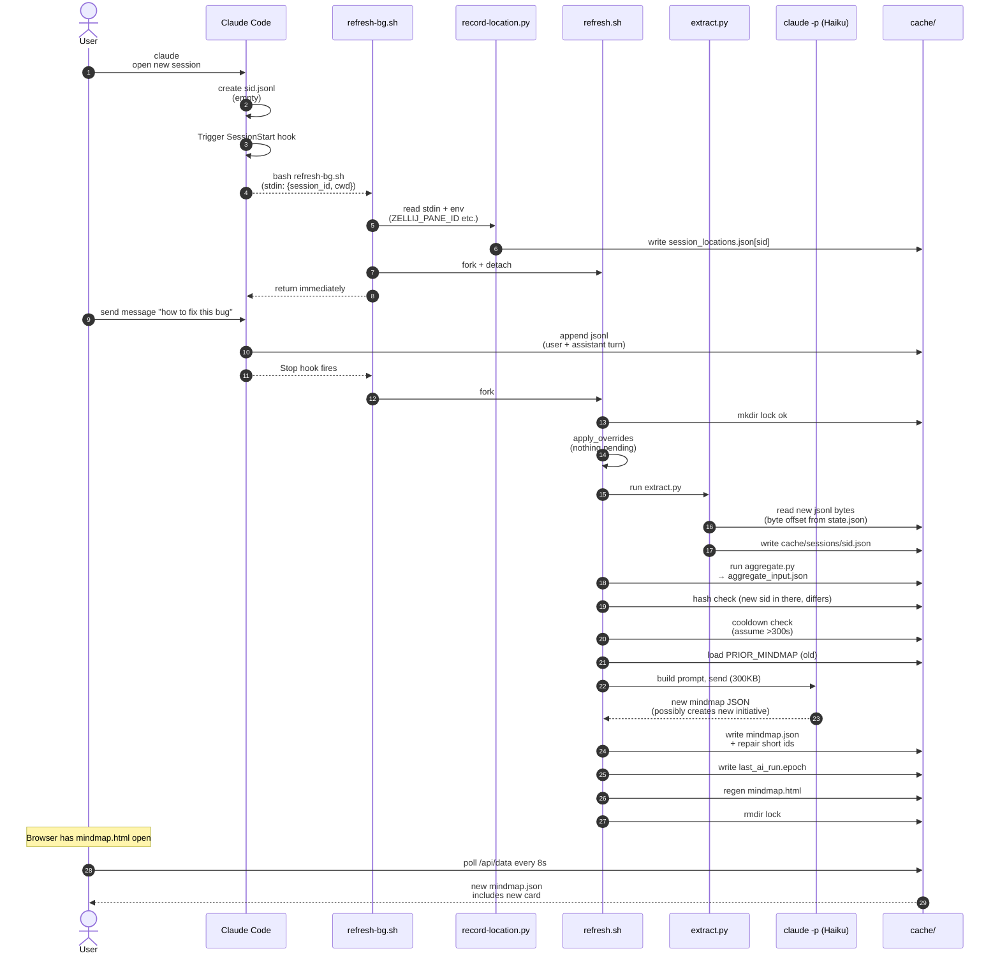
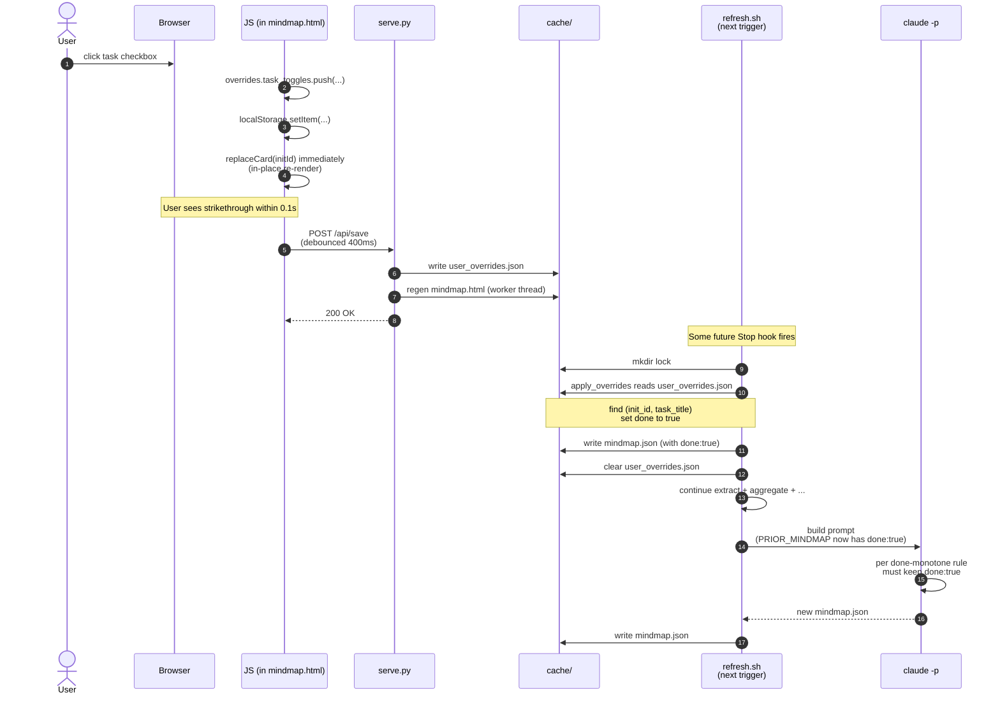
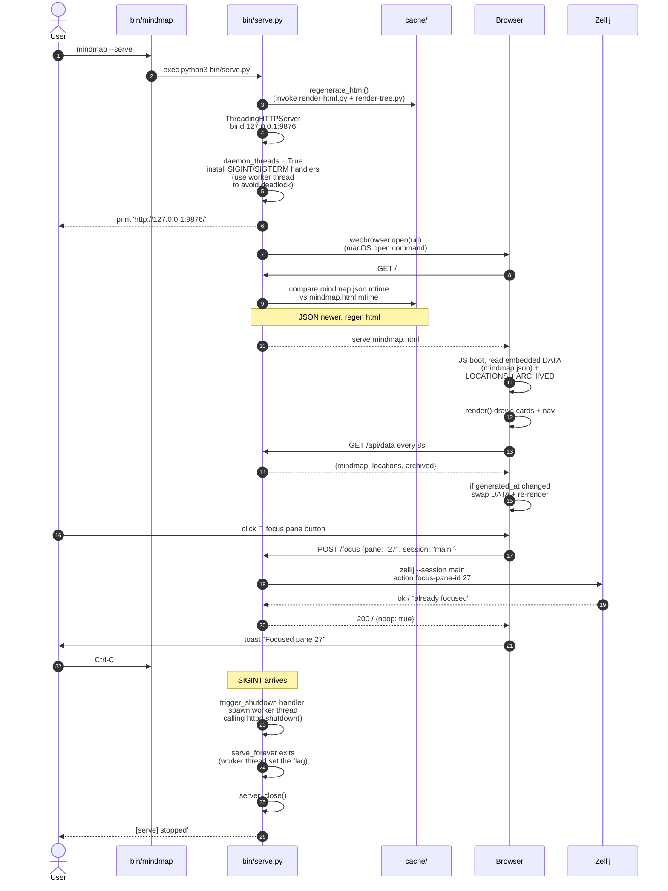
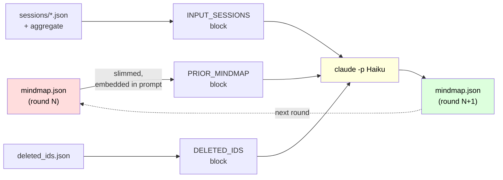
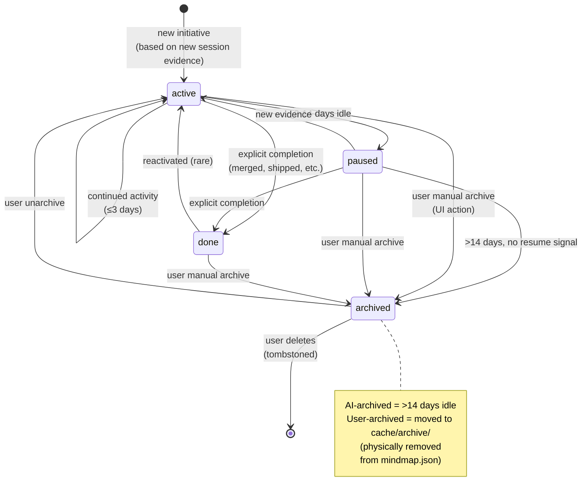
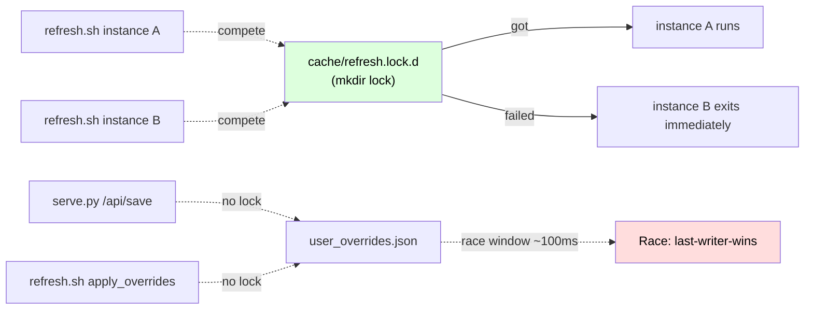

# Architecture

中文版（更详细）：[zh-CN/ARCHITECTURE.md](zh-CN/ARCHITECTURE.md)

After reading this doc you should be able to:
- Explain the tool's working principle in 30 seconds
- Locate the writer and readers of any cache file
- Trace a real user action down to the code path
- Know where to add a feature or fix a bug

---

## 1. 30-second overview

Reads `~/.claude/projects/*.jsonl` (Claude Code's own session log),
feeds a **compressed** view to Haiku 4.5, gets back a **structured
mindmap**, renders to ANSI tree / HTML cards / markmap. The whole flow
runs **automatically** via hooks.

```mermaid
flowchart LR
    A["~/.claude/projects/<br/>*.jsonl<br/>(Claude Code raw log)"] --> B[extract.py]
    B --> C["cache/sessions/<br/>(per-session summary)"]
    C --> D[aggregate.py]
    D --> E["cache/aggregate_input.json<br/>(200 sessions bundled)"]
    E --> F["claude -p<br/>Haiku 4.5"]
    G["cache/mindmap.json<br/>(prior round)"] -.PRIOR_MINDMAP.-> F
    F --> H["cache/mindmap.json<br/>(new round)"]
    H --> R1[render.py - ANSI tree]
    H --> R2[render-html.py - cards]
    H --> R3[render-tree.py - markmap]
    U["User clicks in UI<br/>(toggle / archive / delete)"] -.->|"POST /api/save"| OV["cache/user_overrides.json"]
    OV -.merged into mindmap.json.-> H

    style F fill:#fff3a0,color:#000
    style H fill:#a8e6cf,color:#000
    style G fill:#ffd3b6,color:#000
```

---

## 2. Mental model: three core concepts

The whole project rotates around three abstractions. Understanding them
is half the battle.

| Concept | Physical form | Created by |
|---|---|---|
| **session** | One jsonl file = one Claude Code conversation | Claude Code (automatic) |
| **initiative** | Logical aggregate of one or more sessions = "one piece of work" | AI (during classify) |
| **workspace** | One repo/dir = container of initiatives | AI (usually the cwd) |

Example: you have 5 Claude Code sessions in `~/Code/hsf/hsfops`, doing
"ChangeFree refactor" and "App doc iteration" respectively. AI outputs:

- **workspace** `hsfops`
  - **initiative** `hsfops-changefree-cleanup` (3 of the 5 sessions)
  - **initiative** `hsfops-app-doc-version-no` (2 of the 5 sessions)

An initiative can span multiple cwds (e.g. one feature touching
frontend + backend + skill files). AI picks the **most semantically
fitting** cwd as the primary workspace; others go under `linked_cwds`.

---

## 3. Repository layout

```
claude-code-worktree/
├── bin/                          # All executables
│   ├── install.sh                # One-shot install entry (slash + hook + launchd)
│   ├── install-hook.sh           # Re-install just the hooks
│   ├── uninstall.sh              # Uninstaller
│   ├── mindmap                   # User-facing CLI dispatcher (bash)
│   │
│   ├── refresh.sh                # Core pipeline orchestrator (470 lines bash + python heredoc)
│   ├── refresh-bg.sh             # Non-blocking wrapper for refresh.sh from hooks
│   │
│   ├── extract.py                # jsonl → cache/sessions/<sid>.json (incremental)
│   ├── aggregate.py              # cache/sessions/*.json → aggregate_input.json
│   ├── record-location.py        # hook stdin + env → cache/session_locations.json
│   │
│   ├── render.py                 # mindmap.json → ANSI tree (stdout)
│   ├── render-html.py            # mindmap.json + archive/ + locations → mindmap.html
│   ├── render-tree.py            # mindmap.json → mindmap-tree.html (markmap)
│   │
│   ├── serve.py                  # Local HTTP service (127.0.0.1:9876)
│   └── diagnose.py               # Diagnostic tool (mindmap --diagnose)
│
├── prompts/
│   └── classify.md               # The AI classifier prompt (277 lines)
│
├── commands/                     # Claude Code slash command templates
│   ├── mindmap.md
│   └── mindmap-refresh.md
│
├── launchd/
│   └── com.claude-code-worktree.plist   # macOS LaunchAgent template
│
├── cache/                        # Runtime state, gitignored
│   ├── config.json               # {lang: zh-CN}
│   ├── mindmap.json              # Main output
│   ├── mindmap.html              # Rendered artifact
│   ├── mindmap-tree.html         # Rendered artifact
│   ├── sessions/                 # One summary per session
│   ├── aggregate_input.json      # Fed to AI
│   ├── state.json                # extract's byte-offset table
│   ├── last_input.sha256         # Hash of the last consumed input
│   ├── last_ai_run.epoch         # Timestamp of last real AI call
│   ├── user_overrides.json       # Pending UI edits (to be consumed)
│   ├── deleted_ids.json          # User-deleted initiative tombstones
│   ├── archive/<ws>/<id>.json    # User-archived initiatives (AI never sees these)
│   ├── session_locations.json    # session → zellij pane map
│   └── refresh.lock.d/           # mkdir lock
│
└── docs/                         # This dir
```

By code size: `render-html.py` (1710 lines) > `refresh.sh` (470) >
`render.py` (415) > `serve.py` (388) > `diagnose.py` (332) > everything
else <300.

---

## 4. Component dependency graph

Who calls whom, who reads/writes what. **Solid line = direct call**,
**dashed line = file-mediated**.



Two most important paths:

1. **Data collection**: `jsonl → extract.py → cache/sessions/ → aggregate.py → aggregate_input.json`
2. **AI classification**: `refresh.sh builds prompt → claude -p → parse → mindmap.json`

---

## 5. Pipeline deep dive

`refresh.sh` is the heart of the system. The flowchart below covers
its 11 stages:

```mermaid
flowchart TD
    Start([refresh.sh starts<br/>echo [hook] timestamp]) --> Lock{mkdir<br/>refresh.lock.d<br/>ok?}
    Lock -- "fail" --> Stale{stale<br/>>660s?}
    Stale -- "no" --> Exit1([exit 0:<br/>another running])
    Stale -- "yes" --> Recover[rm + take lock]
    Lock -- "ok" --> ApplyOv
    Recover --> ApplyOv

    ApplyOv["Stage 1: apply user_overrides<br/>1. flip task done<br/>2. remove deleted_tasks<br/>3. remove archived initiatives<br/>4. remove deleted_ids initiatives<br/>(all in-place edit mindmap.json)"] --> Extract

    Extract["Stage 2: extract.py<br/>incrementally read ~/.claude/projects/*.jsonl<br/>update cache/sessions/<sid>.json"] --> Agg

    Agg["Stage 3: aggregate.py<br/>filter is_automation, sort, cap 200<br/>write aggregate_input.json"] --> Empty

    Empty{n_sessions == 0?}
    Empty -- "yes" --> EmptyOut[write empty mindmap.json]
    EmptyOut --> Done0([exit 0])
    Empty -- "no" --> Hash

    Hash["Stage 4: hash check<br/>sha256(aggregate_input.json)<br/>vs last_input.sha256"] --> HashMatch
    HashMatch{same?}
    HashMatch -- "yes" --> BumpOnly["just bump mindmap.json<br/>generated_at + regen HTML"]
    BumpOnly --> Done1([exit 0: skip-hash])

    HashMatch -- "no" --> Cool

    Cool["Stage 5: cooldown gate<br/>now - last_ai_run.epoch<br/>vs COOLDOWN_SECS=300"] --> CoolPass
    CoolPass{cooldown cleared?<br/>or FORCE=1?}
    CoolPass -- "no" --> Done2([exit 0: skip-cooldown])
    CoolPass -- "yes" --> Lang

    Lang["Stage 6: load language<br/>read cache/config.json"] --> Prior
    Prior["Stage 7: load PRIOR_MINDMAP<br/>read current mindmap.json,<br/>slim + embed"] --> Del
    Del["Stage 8: load DELETED_IDS<br/>read deleted_ids.json"] --> Build
    Build["Stage 9: build prompt<br/>classify.md<br/>+ OUTPUT_LANG<br/>+ PRIOR_MINDMAP<br/>+ DELETED_IDS<br/>+ INPUT_SESSIONS"] --> AI

    AI["Stage 10: claude -p<br/>Haiku 4.5<br/>--disallowedTools<br/>--output-format json"] --> Parse

    Parse["Stage 11: parse output<br/>1. extract JSON from ```fence<br/>2. repair short session_ids<br/>(prefix match aggregate_input)<br/>3. write mindmap.json<br/>4. write last_ai_run.epoch<br/>5. write last_input.sha256<br/>6. log DIFF vs prior"] --> Render

    Render["Regen HTML<br/>render-html.py + render-tree.py"] --> DoneOK([exit 0:<br/>'OK ran AI'])

    style AI fill:#fff3a0,color:#000
    style ApplyOv fill:#ffd3b6,color:#000
    style Parse fill:#ffd3b6,color:#000
```

### Code for key stages

#### Stage 2: `extract.py:apply_record` — how a jsonl line becomes summary fields

Each jsonl line is parsed into `rec`, dispatched by `type`:

```python
# bin/extract.py:141 (excerpt)
def apply_record(summary: SessionSummary, rec: dict[str, Any]) -> None:
    t = rec.get("type")
    ts = rec.get("timestamp")
    if ts:
        if summary.started_at is None or ts < summary.started_at:
            summary.started_at = ts
        if summary.last_activity_at is None or ts > summary.last_activity_at:
            summary.last_activity_at = ts

    if t == "user":
        # User message: extract text as prompt
        text = extract_text_from_message(msg).strip()
        if text and not rec.get("toolUseResult"):
            summary.user_message_count += 1
            if summary.first_user_prompt is None:
                summary.first_user_prompt = text[:PROMPT_TRIM]
            summary.recent_user_prompts.append(text[:PROMPT_TRIM])
            # Keep last RECENT_PROMPT_LIMIT=5
            if len(summary.recent_user_prompts) > RECENT_PROMPT_LIMIT:
                summary.recent_user_prompts = summary.recent_user_prompts[-RECENT_PROMPT_LIMIT:]

    elif t == "assistant":
        # AI reply: extract text blocks, record tool use, track edited_files
        for block in content:
            if block["type"] == "tool_use":
                name = block.get("name")
                if name in ("Write", "Edit", "NotebookEdit"):
                    fp = block["input"].get("file_path")
                    summary.edited_files.append(fp)   # what actually changed
            elif block["type"] == "text":
                # Keep first 1500 chars of the LAST assistant reply
                summary.last_assistant_summary = _summarize_assistant(combined)

    elif t == "system" and rec.get("subtype") == "away_summary":
        summary.recap = rec.get("content")  # Claude Code's native recap
```

This is **why compression is lossy**: each session keeps only first/recent
prompts + last_assistant_summary + machine signals (edited_files,
tools_used, task_events). That's the part [DD-001](design/DD-001-two-pass-classification.md)
plans to replace.

#### Stage 9: how refresh.sh builds the prompt

```bash
# bin/refresh.sh:266 (excerpt)
{
  cat "$PROMPT_FILE"               # prompts/classify.md
  echo
  echo "OUTPUT_LANG: $OUTPUT_LANG"
  echo
  echo "CURRENT_TIME: $NOW_ISO"
  echo
  if [ -n "$PRIOR_BLOCK" ]; then
    echo "PRIOR_MINDMAP:"
    echo "$PRIOR_BLOCK"             # last mindmap.json slimmed down
    echo
  fi
  if [ -n "$DEL_BLOCK" ]; then
    echo "DELETED_IDS:"
    echo "$DEL_BLOCK"
    echo "(These IDs are user-deleted tombstones. Do NOT include them...)"
  fi
  echo "INPUT_SESSIONS:"
  cat "$INPUT_FILE"                 # aggregate_input.json, ~200 sessions
} > "$FULL_PROMPT_FILE"
```

Pure string concatenation, no template engine. Final ~300KB, saved by
prompt caching (cache read on Haiku is 1/10 the price of regular tokens).

#### Stage 10: invoking claude -p

```bash
# bin/refresh.sh:298
perl -e 'alarm shift @ARGV; exec @ARGV' "$CLAUDE_TIMEOUT_SECS" \
    claude -p \
      --model "$CLAUDE_MODEL" \
      --output-format json \
      --disallowedTools "Bash Edit Write Read Glob Grep" \
      < "$FULL_PROMPT_FILE" \
      > "$CACHE_DIR/_raw_output.json"
```

Key choices:
- `perl alarm` replaces `timeout` (macOS doesn't have `timeout`)
- `--output-format json` returns an envelope with `usage` and `total_cost_usd`
- `--disallowedTools` blocks all tools so AI can only emit text (won't start running Bash on its own)

---

## 6. Triggers and rate control

When does refresh.sh actually invoke AI? See the decision tree:



### Trigger sources

| Source | Frequency | Path |
|---|---|---|
| Claude Code `Stop` hook | Each assistant response | `bash refresh-bg.sh` fork+detach |
| Claude Code `SessionStart` hook | Session open/resume | Same |
| macOS LaunchAgent | Every 2h | Same |
| `mindmap --refresh` | User command | Direct, sets FORCE=1 |
| `POST /api/refresh` | UI 🔄 button | spawn refresh.sh, optional FORCE |

### Why a dedicated `last_ai_run.epoch` instead of mindmap.json mtime

Historical bug (fixed in commit `9f01447`):
- Old logic used `stat mindmap.json` mtime to compute cooldown
- But Stage 1 apply-overrides ALSO writes mindmap.json, polluting mtime
- User toggles task in UI → user_overrides.json → next Stop hook → apply
  writes mindmap.json → mtime reset to 0s → cooldown forever "still cool"
  → AI never runs

Lesson: **a cooldown gate should not be measured against the target
file's mtime — use a dedicated marker**.

---

## 7. Cache data model

Shape and owners of each cache file:



### Sample contents

See the Chinese version
[zh-CN/ARCHITECTURE.md § 7](zh-CN/ARCHITECTURE.md#7-cache-数据模型) for
JSON samples of each file. Same shape, just transcribed once.

---

## 8. End-to-end walkthroughs

### Walkthrough 1: a new session becomes a card



Key moments:
- Steps 1-5: new session just started, hook recorded location but jsonl is still empty
- Steps 6-7: user's first message gives jsonl its first content
- Step 13: extract.py reads incrementally, **only new bytes** (state.json tracks the last read position)
- Step 17: AI sees this new session_id in INPUT_SESSIONS but not in PRIOR_MINDMAP — will create a new initiative
- Step 25: browser shows the new card within 8 seconds (no page reload)

### Walkthrough 2: user clicks task done in UI



Key points:
- Step 4: user sees the effect **immediately**, no server roundtrip
- Step 6: disk write debounced 400ms — clicking fast doesn't flood requests
- Steps 11-12: apply_overrides bakes user intent into mindmap.json
- Step 16: even if AI doesn't realize this matters, the done-monotone rule in the prompt forces it to keep done:true

### Walkthrough 3: `mindmap --serve` from launch to page



Key design points:
- Step 7: **daemon_threads + worker thread shutdown** is required. Otherwise
  the SIGINT handler synchronously calling `shutdown()` deadlocks
  (the bug behind commit `9f01447`)
- Steps 12-13: every GET / the server checks if json is newer than html
  and regenerates — saves the user from manual restarts
- Steps 18-20: every 8s polling, if generated_at changed **silently swap
  data**, no page reload (preserves scroll position and search box)

---

## 9. Continuity model: the PRIOR_MINDMAP feedback loop

The thing that makes this tool actually useful isn't AI being smart every
run — it's **letting AI incrementally update on top of its last output**.



`prompts/classify.md` has a **Continuity rules** section constraining AI:

1. **Stable id**: same conceptual work must reuse the same id, even if
   name slightly evolves
2. **Conservative renaming**: task title shouldn't be casually rewritten
3. **Monotone done**: once marked done, can't be reverted
4. **Status decay**:
5. **Don't delete prior tasks**: they're history
6. **New entries justified**: new task/initiative needs evidence in INPUT_SESSIONS

This feedback loop is exactly why "user-marked-done tasks survive AI" —
AI sees `done: true` in PRIOR and the monotone rule forbids change.

Details in [`prompts/classify.md`](../prompts/classify.md) Continuity
rules section.

---

## 10. Initiative state machine

Each initiative's status field cycles through 4 states:



Two kinds of `archived`:
- **AI-marked archived**: still in mindmap.json, just status=archived
- **User-archived via UI**: physically moved to `cache/archive/<ws>/<id>.json`;
  mindmap.json no longer contains the initiative. HTML still shows it
  because render-html reads the archive/ dir

---

## 11. Concurrency and atomicity

Current locking is minimal — fine for single-user, single-host.



### Current state

| Risk | Protection |
|---|---|
| Two refresh.sh in parallel | `cache/refresh.lock.d` mkdir lock |
| `/api/save` racing apply_overrides | None; ~100ms window |
| Multiple browser tabs POST | None; last-writer-wins |
| Reader sees half-written json | None; json.dump is not atomic |

### Hardening plan

Detailed design in [ROADMAP.md → P11.0](ROADMAP.md#p110--concurrency-lock-for-cache-writes).

Core idea: `bin/_cache_lock.py` provides an `fcntl.flock` context manager;
all writers to cache files use a common-name lock to serialize.
`mindmap.json` writes switch to atomic `tmp + rename`.

---

## 12. Key invariants

Enforced by code or prompt. Violations are bugs.

1. `cache/mindmap.json` schema_version == 2
2. Every initiative has non-empty `id` and `sessions[]`
3. `sessions[]` entries are full UUIDs (refresh.sh post-process repairs
   truncation; commit `9f01447`)
4. A task once `done: true` stays so across refreshes (unless user
   un-checks in UI)
5. Archived initiatives never in PRIOR_MINDMAP (refresh.sh strips before
   building prompt)
6. `cache/last_ai_run.epoch` bumped iff a real AI call succeeded (commit `9f01447`)
7. `aggregate.py` skips `is_automation=true` sessions (prevents the
   classifier from seeing itself)

---

## 13. Known weaknesses

Where this architecture isn't great:

### 13.1 Per-session understanding depth

`extract.py` hard-compresses each session to ~1.5KB. AI never sees full
conversation. Symptom: long sessions have cards whose progress lags
real work.

**Typical case**: 90 minutes of bug-hunting, found root cause, filed an
Aone ISSUE — but the card still says "still investigating", because
`last_assistant_summary` is just the first 1500 chars of the last
reply (which happened to be "good question, let me think").

**Fix**: [DD-001](design/DD-001-two-pass-classification.md) replaces
hard compression with per-session AI summaries.

### 13.2 Global cooldown is too coarse

`last_ai_run.epoch` is a single global gate — you can't "refresh just
this one card" without re-classifying all 200 sessions. Same DD-001
solves this.

### 13.3 Cross-host / multi-user

Loopback-only is intentional. No remote access, no collaboration, no
plans to support either.

---

## 14. Learning path

You've now seen the whole system. Suggested next steps:

1. **Run it**: `mindmap --diagnose` to see your current pipeline state
2. **Trace a real session**: find your most recent session_id, use
   `mindmap --diagnose <sid>` to walk through stages
3. **Tweak one constant**: try changing `SUMMARY_TRIM` in `extract.py`
   or `COOLDOWN_SECS` default in `refresh.sh`, run `mindmap --refresh`
   and observe the DIFF output
4. **Read the prompt**: `cat prompts/classify.md`, think about why AI
   behavior doesn't always match expectations
5. **Read a DD**: [DD-001](design/DD-001-two-pass-classification.md)
   is the most consequential pending design

Want a deeper dive on any specific component? Let me know.
