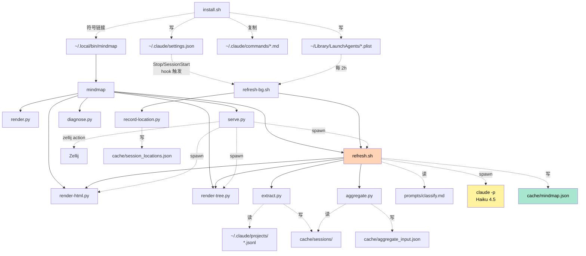
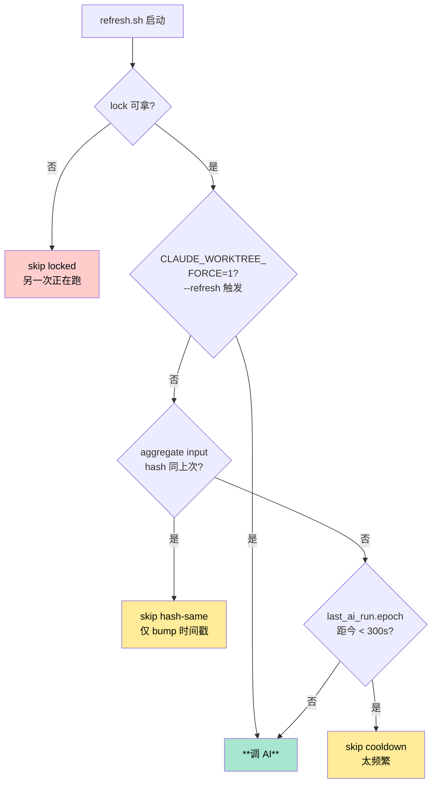
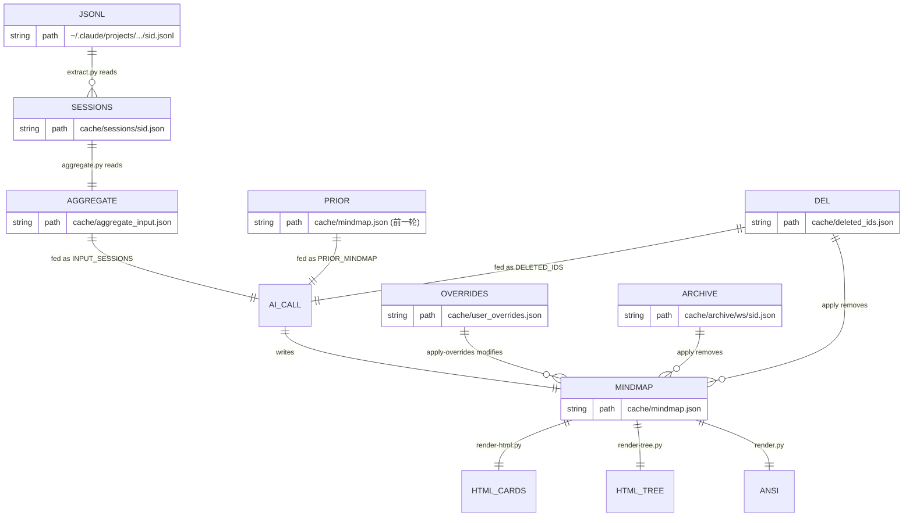
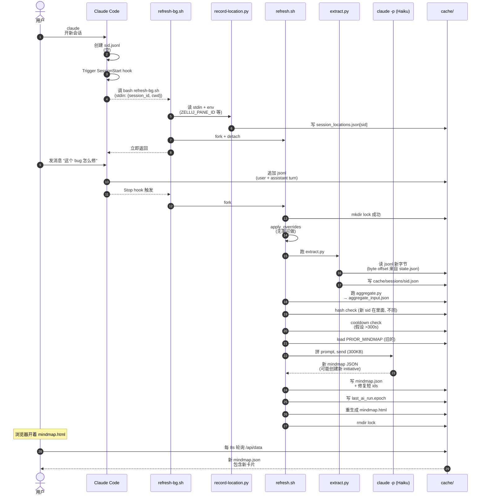
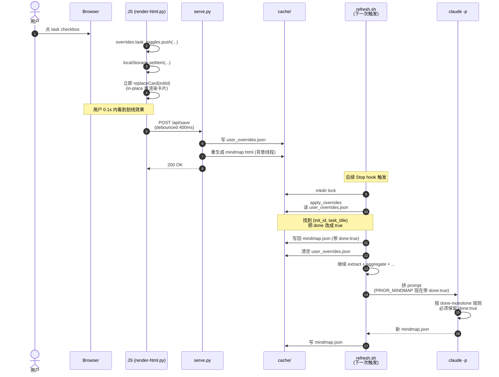
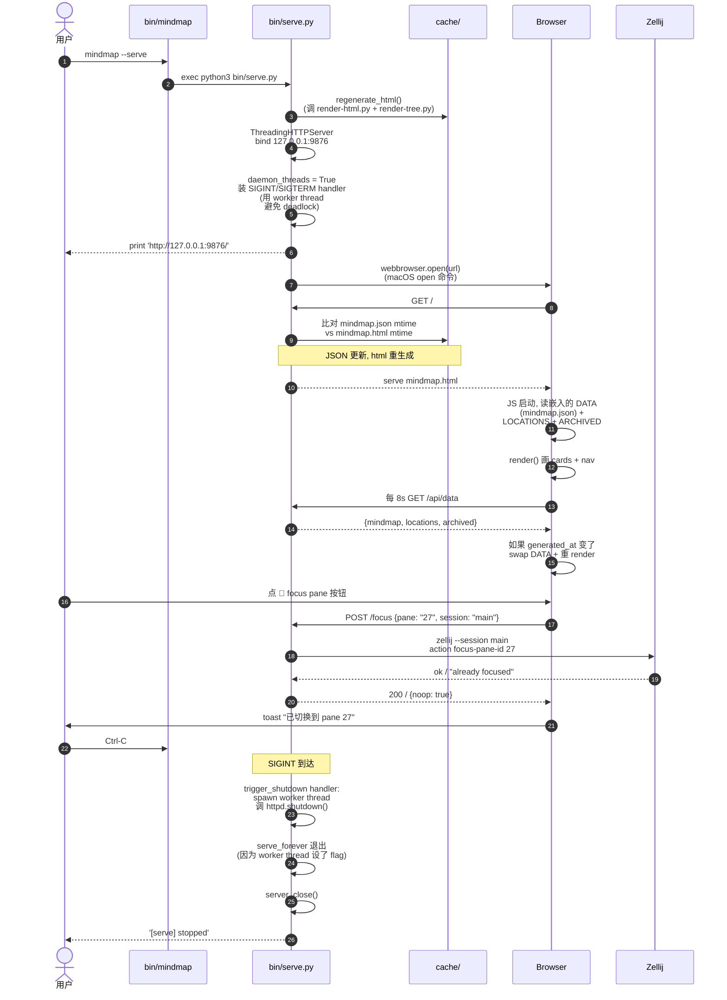
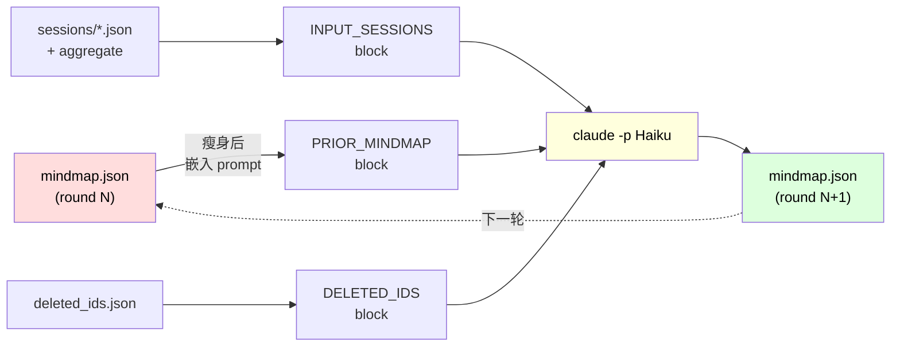
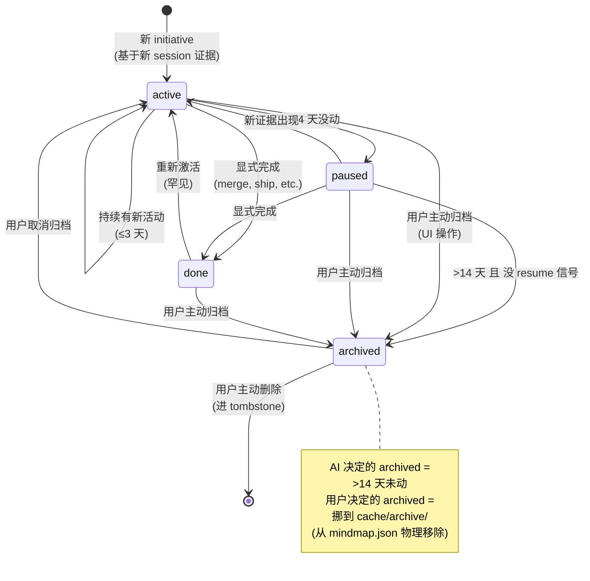
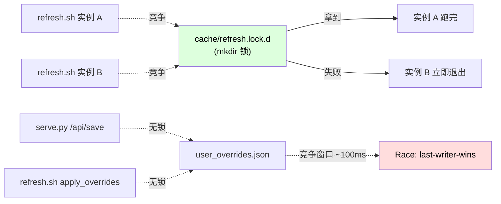

# 架构

英文版：[../ARCHITECTURE.md](../ARCHITECTURE.md)

读完这份文档，你应该能够：
- 在 30 秒内向别人讲清楚这个工具的工作原理
- 找到任何一个 cache 文件的写入方和读取方
- 从一个真实用户操作追溯出整条代码路径
- 知道哪里加新功能、哪里改 bug

---

## 1. 30 秒看懂

读 `~/.claude/projects/*.jsonl`（Claude Code 自己的会话日志），把
**压缩后**的视图喂给 Haiku 4.5，拿回一份**结构化脑图**，渲染成
ANSI 树/HTML 卡片/markmap。整个流程在 hook 里**自动**跑。

```mermaid
flowchart LR
    A["~/.claude/projects/<br/>*.jsonl<br/>(Claude Code 原始日志)"] --> B[extract.py]
    B --> C["cache/sessions/<br/>(每 session 一份摘要)"]
    C --> D[aggregate.py]
    D --> E["cache/aggregate_input.json<br/>(200 session 拼起来)"]
    E --> F["claude -p<br/>Haiku 4.5"]
    G["cache/mindmap.json<br/>(上一轮结果)"] -.PRIOR_MINDMAP.-> F
    F --> H["cache/mindmap.json<br/>(新一轮结果)"]
    H --> R1[render.py - ANSI 树]
    H --> R2[render-html.py - 卡片]
    H --> R3[render-tree.py - 思维导图]
    U["用户在 UI 上的<br/>勾选/归档/删除"] -.->|"POST /api/save"| OV["cache/user_overrides.json"]
    OV -.合并进 mindmap.json.-> H

    style F fill:#fff3a0,color:#000
    style H fill:#a8e6cf,color:#000
    style G fill:#ffd3b6,color:#000
```

---

## 2. 心智模型：三个核心概念

整个项目围绕三个抽象。理解它们就理解了一半。

| 概念 | 物理对应 | 谁创建 |
|---|---|---|
| **session** | 一个 jsonl 文件 = Claude Code 的一次会话 | Claude Code 自动写 |
| **initiative** | 一个或多个 session 的逻辑聚合 = "一项工作" | AI 推断（在 classify 阶段） |
| **workspace** | 一个仓库/目录 = initiative 的容器 | AI 推断（通常对应 cwd） |

例子：你在 `~/Code/hsf/hsfops` 里有 5 个 Claude Code session，
分别在做 "ChangeFree 重构" 和 "应用文档迭代"。AI 看到这些 session
后会输出：

- **workspace** `hsfops`
  - **initiative** `hsfops-changefree-cleanup`（5 个 session 里的 3 个）
  - **initiative** `hsfops-app-doc-version-no`（5 个 session 里的 2 个）

一个 initiative 横跨多个 cwd 也是允许的（如同时改 frontend + backend
+ skill 文件做一个特性），AI 会选其中**最有归属感**的那个 cwd 当主
workspace，其余记到 `linked_cwds`。

---

## 3. 仓库目录结构

```
claude-code-worktree/
├── bin/                          # 所有可执行
│   ├── install.sh                # 一次性安装入口（slash command + hook + launchd）
│   ├── install-hook.sh           # 单独重装 hook 的快捷脚本
│   ├── uninstall.sh              # 卸载
│   ├── mindmap                   # 用户向 CLI 分发器（bash），所有命令的入口
│   │
│   ├── refresh.sh                # 核心 pipeline 编排器（470 行 bash + python heredoc）
│   ├── refresh-bg.sh             # hook 触发 refresh.sh 的非阻塞包装
│   │
│   ├── extract.py                # jsonl → cache/sessions/<sid>.json（增量）
│   ├── aggregate.py              # cache/sessions/*.json → aggregate_input.json
│   ├── record-location.py        # hook stdin + env → cache/session_locations.json
│   │
│   ├── render.py                 # mindmap.json → ANSI 树 (stdout)
│   ├── render-html.py            # mindmap.json + archive/ + locations → mindmap.html
│   ├── render-tree.py            # mindmap.json → mindmap-tree.html (markmap)
│   │
│   ├── serve.py                  # 本地 HTTP 服务 (127.0.0.1:9876)
│   └── diagnose.py               # 排障工具（mindmap --diagnose）
│
├── prompts/
│   └── classify.md               # 给 AI 的分类 prompt（277 行）
│
├── commands/                     # Claude Code slash command 模板
│   ├── mindmap.md                # /mindmap
│   └── mindmap-refresh.md        # /mindmap-refresh
│
├── launchd/
│   └── com.claude-code-worktree.plist   # macOS LaunchAgent 模板
│
├── cache/                        # 运行时状态，gitignore
│   ├── config.json               # {lang: zh-CN}
│   ├── mindmap.json              # 主输出
│   ├── mindmap.html              # 渲染产物
│   ├── mindmap-tree.html         # 渲染产物
│   ├── sessions/                 # 每 session 一份摘要
│   ├── aggregate_input.json      # 喂给 AI 的输入
│   ├── state.json                # extract 的 byte offset 表
│   ├── last_input.sha256         # 上次 input 的 hash
│   ├── last_ai_run.epoch         # 上次真实 AI 跑的时间戳
│   ├── user_overrides.json       # 用户在 UI 上的编辑（待消费）
│   ├── deleted_ids.json          # 用户主动删除的 initiative tombstone
│   ├── archive/<ws>/<id>.json    # 用户归档的 initiative（AI 永远看不到）
│   ├── session_locations.json    # session → zellij pane 映射
│   └── refresh.lock.d/           # mkdir 锁
│
└── docs/                         # 本目录
    ├── README.md                 # 索引
    ├── ARCHITECTURE.md           # 本文（英文）
    ├── CONTRIBUTING.md
    ├── TROUBLESHOOTING.md
    ├── ROADMAP.md
    ├── design/                   # DD-NNN 设计文档
    └── zh-CN/                    # 中文镜像
```

按代码量：`render-html.py` (1710 行) > `refresh.sh` (470 行) >
`render.py` (415 行) > `serve.py` (388 行) > `diagnose.py` (332 行)
> 其它都 <300 行。

---

## 4. 组件依赖图

谁调用谁、谁读谁写。**实线 = 直接调用**，**虚线 = 通过文件交换数据**。



最重要的两条路径：

1. **数据采集路径**：`jsonl → extract.py → cache/sessions/ → aggregate.py → aggregate_input.json`
2. **AI 分类路径**：`refresh.sh 拼 prompt → claude -p → 解析 → mindmap.json`

---

## 5. Pipeline 流程详解

`refresh.sh` 是整个系统的心脏，下面的流程图覆盖了它的 11 个阶段：

```mermaid
flowchart TD
    Start([refresh.sh 启动<br/>echo [hook] timestamp]) --> Lock{mkdir<br/>refresh.lock.d<br/>成功?}
    Lock -- "失败" --> Stale{stale<br/>>660s?}
    Stale -- "否" --> Exit1([exit 0:<br/>another running])
    Stale -- "是" --> Recover[rm + 重建 lock]
    Lock -- "ok" --> ApplyOv
    Recover --> ApplyOv

    ApplyOv["阶段 1: 应用 user_overrides<br/>1. task done 翻转<br/>2. 删除 deleted_tasks<br/>3. 移除 archived initiatives<br/>4. 移除 deleted_ids initiatives<br/>(全部 in-place 改 mindmap.json)"] --> Extract

    Extract["阶段 2: extract.py<br/>增量读 ~/.claude/projects/*.jsonl<br/>更新 cache/sessions/<sid>.json"] --> Agg

    Agg["阶段 3: aggregate.py<br/>过滤 is_automation, 排序<br/>裁到 200 条, 写 aggregate_input.json"] --> Empty

    Empty{n_sessions == 0?}
    Empty -- "是" --> EmptyOut[写空 mindmap.json]
    EmptyOut --> Done0([exit 0])
    Empty -- "否" --> Hash

    Hash["阶段 4: hash 检查<br/>sha256(aggregate_input.json)<br/>vs last_input.sha256"] --> HashMatch
    HashMatch{相同?}
    HashMatch -- "是" --> BumpOnly["仅 bump mindmap.json<br/>generated_at<br/>+ 重生成 HTML"]
    BumpOnly --> Done1([exit 0: skip-hash])

    HashMatch -- "否" --> Cool

    Cool["阶段 5: cooldown 闸门<br/>now - last_ai_run.epoch<br/>vs COOLDOWN_SECS=300"] --> CoolPass
    CoolPass{已过冷却?<br/>或 FORCE=1?}
    CoolPass -- "否" --> Done2([exit 0: skip-cooldown])
    CoolPass -- "是" --> Lang

    Lang["阶段 6: 加载语言<br/>读 cache/config.json"] --> Prior
    Prior["阶段 7: 加载 PRIOR_MINDMAP<br/>读当前 mindmap.json,<br/>瘦身后嵌入"] --> Del
    Del["阶段 8: 加载 DELETED_IDS<br/>读 deleted_ids.json"] --> Build
    Build["阶段 9: 拼 prompt<br/>classify.md<br/>+ OUTPUT_LANG<br/>+ PRIOR_MINDMAP<br/>+ DELETED_IDS<br/>+ INPUT_SESSIONS"] --> AI

    AI["阶段 10: claude -p<br/>Haiku 4.5<br/>--disallowedTools<br/>--output-format json"] --> Parse

    Parse["阶段 11: 解析输出<br/>1. 提 JSON from ```fence<br/>2. 修复短 session_id<br/>(前缀匹配 aggregate_input)<br/>3. 写 mindmap.json<br/>4. 写 last_ai_run.epoch<br/>5. 写 last_input.sha256<br/>6. log DIFF vs prior"] --> Render

    Render["重生成 HTML<br/>render-html.py + render-tree.py"] --> DoneOK([exit 0:<br/>'OK ran AI'])

    style AI fill:#fff3a0,color:#000
    style ApplyOv fill:#ffd3b6,color:#000
    style Parse fill:#ffd3b6,color:#000
```

### 关键阶段的代码

#### 阶段 2: `extract.py:apply_record` 怎么把 jsonl 一行变成摘要字段

每条 jsonl 行被解析成 `rec`，按 `type` 分发：

```python
# bin/extract.py:141 (节选)
def apply_record(summary: SessionSummary, rec: dict[str, Any]) -> None:
    t = rec.get("type")
    ts = rec.get("timestamp")
    if ts:
        if summary.started_at is None or ts < summary.started_at:
            summary.started_at = ts
        if summary.last_activity_at is None or ts > summary.last_activity_at:
            summary.last_activity_at = ts

    if t == "user":
        # 用户消息：抽出文本作为 prompt
        text = extract_text_from_message(msg).strip()
        if text and not rec.get("toolUseResult"):
            summary.user_message_count += 1
            if summary.first_user_prompt is None:
                summary.first_user_prompt = text[:PROMPT_TRIM]
            summary.recent_user_prompts.append(text[:PROMPT_TRIM])
            # 保留最后 RECENT_PROMPT_LIMIT=5 条
            if len(summary.recent_user_prompts) > RECENT_PROMPT_LIMIT:
                summary.recent_user_prompts = summary.recent_user_prompts[-RECENT_PROMPT_LIMIT:]

    elif t == "assistant":
        # AI 回复：抽 text 块、记录工具使用、追踪 edited_files
        for block in content:
            if block["type"] == "tool_use":
                name = block.get("name")
                if name in ("Write", "Edit", "NotebookEdit"):
                    fp = block["input"].get("file_path")
                    summary.edited_files.append(fp)   # 真正动了哪些文件
            elif block["type"] == "text":
                # 保留**最后一条 assistant 回复**的前 1500 字符
                summary.last_assistant_summary = _summarize_assistant(combined)

    elif t == "system" and rec.get("subtype") == "away_summary":
        summary.recap = rec.get("content")  # Claude Code 自带的会话回顾
```

理解这段代码就理解了**为什么压缩是 lossy 的**：每个 session 最终只保
留 first/recent prompts + last_assistant_summary + 一些机器信号
（edited_files 列表、tools_used、task_events）。这正是 [DD-001](design/DD-001-two-pass-classification.md) 要替换掉的部分。

#### 阶段 9: refresh.sh 怎么拼 prompt

```bash
# bin/refresh.sh:266 (节选)
{
  cat "$PROMPT_FILE"               # prompts/classify.md
  echo
  echo "OUTPUT_LANG: $OUTPUT_LANG" # 注入语言
  echo
  echo "CURRENT_TIME: $NOW_ISO"
  echo
  if [ -n "$PRIOR_BLOCK" ]; then
    echo "PRIOR_MINDMAP:"
    echo "$PRIOR_BLOCK"             # 上次 mindmap.json 瘦身后
    echo
  fi
  if [ -n "$DEL_BLOCK" ]; then
    echo "DELETED_IDS:"
    echo "$DEL_BLOCK"
    echo "(These IDs are user-deleted tombstones. Do NOT include them...)"
  fi
  echo "INPUT_SESSIONS:"
  cat "$INPUT_FILE"                 # aggregate_input.json，~200 sessions
} > "$FULL_PROMPT_FILE"
```

整个 prompt 是简单的字符串拼接，没有模板引擎。最终 ~300KB，由
prompt cache 节省了重复成本（在 Haiku 上 cache read 是普通 token 的
1/10 价格）。

#### 阶段 10: 调 claude -p

```bash
# bin/refresh.sh:298
perl -e 'alarm shift @ARGV; exec @ARGV' "$CLAUDE_TIMEOUT_SECS" \
    claude -p \
      --model "$CLAUDE_MODEL" \
      --output-format json \
      --disallowedTools "Bash Edit Write Read Glob Grep" \
      < "$FULL_PROMPT_FILE" \
      > "$CACHE_DIR/_raw_output.json"
```

几个关键点：
- 用 `perl alarm` 替代 `timeout`（macOS 没有 `timeout` 命令）
- `--output-format json` 让 envelope 包含 `usage` 和 `total_cost_usd`
- `--disallowedTools` 禁掉所有工具，AI 只能输出文本（不会自己开始 Bash 一通乱搞）

---

## 6. 触发与频率控制

什么时候 refresh.sh 真正会调用 AI？看这个决策树：



### 触发源汇总

| 源 | 频率 | 路径 |
|---|---|---|
| Claude Code `Stop` hook | 每轮 assistant 响应后 | `bash refresh-bg.sh` fork+detach |
| Claude Code `SessionStart` hook | session 开/恢复 | 同上 |
| macOS LaunchAgent | 每 2h | 同上 |
| `mindmap --refresh` | 用户命令 | 直跑，置 FORCE=1 |
| `POST /api/refresh` | UI 上 🔄 按钮 | spawn refresh.sh，可选 FORCE |

### 为什么用独立的 `last_ai_run.epoch` 而不是 mindmap.json mtime

历史 bug（已修，commit `9f01447`）：
- 旧逻辑用 `stat mindmap.json` 算距上次"AI 跑"多久
- 但阶段 1 apply-overrides 也写 mindmap.json，会污染 mtime
- 用户在 UI 勾任务 → user_overrides.json → 下次 Stop hook → apply 写
  mindmap.json → mtime 重置为 0s → cooldown 永远 "still cool"
  → AI 永远跑不起来

教训：**做闸门 ≠ 测目标文件的 mtime，要有专属 marker**。

---

## 7. Cache 数据模型

每个 cache 文件的形状和读写者：



### 各文件 sample

**cache/sessions/cbbeb23c…json**（一个 session 的摘要）：
```json
{
  "session_id": "cbbeb23c-b6f9-4eb4-926e-7e4046c856d4",
  "cwd": "/Users/bby/Code/pandora/pandora-sar/hsf",
  "started_at": "2026-05-13T07:30:00Z",
  "last_activity_at": "2026-05-13T09:19:46Z",
  "message_count": 155,
  "user_message_count": 16,
  "first_user_prompt": "排查 EagleEye 链路追踪服务端 IP 为空 ...",
  "recent_user_prompts": ["...", "...", "...", "...", "..."],
  "last_assistant_summary": "好问题，值得停下来想清楚。\n\n## 短答\n因为 ...",
  "edited_files": ["/tmp/aone-issue-hsf-eagleeye.md"],
  "task_events": [],
  "recap": "在排查 EagleEye trace ...",
  "tools_used": ["Bash", "Read", "WebFetch"],
  "is_automation": false
}
```

**cache/mindmap.json**（主输出，schema v2）：
```json
{
  "schema_version": 2,
  "generated_at": "2026-05-13T09:23:38Z",
  "workspaces": [
    {
      "name": "pandora/pandora-sar/hsf",
      "cwd": "/Users/bby/Code/pandora/pandora-sar/hsf",
      "last_activity_at": "2026-05-13T09:19:46Z",
      "initiatives": [
        {
          "id": "hsf-eagleeye-ip-null-issue",
          "name": "HSF EagleEye 链路追踪服务端 IP 为空问题排查",
          "status": "active",
          "summary": "...",
          "progress": "...",
          "tasks": [
            {"title": "分析 injvm 场景下 IP 为空", "done": false}
          ],
          "sessions": ["cbbeb23c-b6f9-4eb4-926e-7e4046c856d4"],
          "linked_cwds": [],
          "last_activity_at": "2026-05-13T09:19:46Z"
        }
      ]
    }
  ]
}
```

**cache/user_overrides.json**（用户编辑，待消费）：
```json
{
  "version": 1,
  "task_toggles": [
    {"init_id": "hsfops-changefree-cleanup",
     "task_title": "编译验证和 review 就绪",
     "done": true,
     "at": "2026-05-13T08:00:00Z"}
  ],
  "deleted_tasks": [],
  "updated_at": "2026-05-13T08:00:00Z"
}
```

下次 `refresh.sh` 阶段 1 把上面那条 toggle 烤进 mindmap.json，然后
清空这个文件。

**cache/session_locations.json**：
```json
{
  "version": 1,
  "by_session_id": {
    "cbbeb23c-…": {
      "session_id": "cbbeb23c-…",
      "cwd": "/Users/bby/Code/pandora/pandora-sar/hsf",
      "zellij_session": "main",
      "zellij_pane_id": "27",
      "term_program": "ghostty",
      "started_at": "2026-05-13T07:30:00Z",
      "updated_at": "2026-05-13T09:19:46Z"
    }
  }
}
```

HTML 卡片上"@ pane 27 (main)"标记就来自这里。

---

## 8. 实战走查

把抽象的 pipeline 配上具体场景，串一遍。

### 走查 1: 一个全新 session 怎么从对话变成卡片



关键时间点：
- 步骤 1-5：新 session 刚起来，hook 已经写 location 信息但 jsonl 还没内容
- 步骤 6-7：用户首条消息让 jsonl 第一次有内容
- 步骤 13：extract.py 增量读，**只读新字节**（state.json 记录上次读到哪）
- 步骤 17：AI 看到这个新 session_id 在 INPUT_SESSIONS 但不在 PRIOR_MINDMAP，会创建新 initiative
- 步骤 25：浏览器 8 秒后看到新卡片（不用刷新页面）

### 走查 2: 用户在 UI 上勾完成 task



关键点：
- 步骤 4：用户**立刻看到效果**，不等服务器
- 步骤 6：写盘是 debounce 400ms 的，连续点不会请求洪水
- 步骤 11-12：apply_overrides 把用户的意图烤进 mindmap.json
- 步骤 16：即使 AI 不太懂这事重要，prompt 里的 done-monotone 规则强制它保留

### 走查 3: `mindmap --serve` 启动到看到页面



关键设计：
- 步骤 7：**daemon_threads + worker thread shutdown** 是必需的。否
  则 SIGINT 处理器同步调 `shutdown()` 会 deadlock（之前的 bug
  `9f01447`）
- 步骤 12-13：每次 GET /，server 检查 json 比 html 新就**重生成
  html**，避免用户反复重启
- 步骤 18-20：每 8s 轮询，generated_at 变了**静默 swap 数据**，不刷
  新页面（保留滚动位置和搜索框状态）

---

## 9. 连续性模型：PRIOR_MINDMAP 反馈循环

这套东西能用起来的关键不是 AI 每次都聪明，而是**让 AI 在上一次的输
出基础上 incrementally update**。



`prompts/classify.md` 里有一段 **Continuity rules**，约束 AI：

1. **id 稳定**：同一概念的工作必须复用 id，即使 name 微调
2. **name 慎重**：task title 不要无谓地重写
3. **done 单调**：标完成的不能反悔
4. **status 衰减**：
5. **不删 prior task**：它们是历史
6. **新增有据**：新 task/initiative 必须能从 INPUT_SESSIONS 找到依据

正是这个反馈循环让"用户勾完成的 task 不会被 AI 撤销"这种事情成立——
AI 在 prior 里看到 `done: true`，按 monotone 规则不能改。

详情见 [`prompts/classify.md`](../../prompts/classify.md) 的
"Continuity rules" 段。

---

## 10. Initiative 状态机

每个 initiative 的 status 字段在 4 个状态之间转：



注意两种 archived 的差别：
- **AI 标的 archived**：还在 mindmap.json 里，只是 status=archived
- **用户在 UI 点归档**：物理移到 `cache/archive/<ws>/<id>.json`，
  mindmap.json 不再有这个 initiative。HTML 仍能展示因为 render-html
  会读 archive/ 目录

---

## 11. 并发与原子性

当前的锁很简陋，单用户单机够用。



### 现状

| 风险 | 防护 |
|---|---|
| 两次 refresh.sh 并行 | `cache/refresh.lock.d` mkdir 锁 |
| `serve.py /api/save` 和 `apply_overrides` 竞争 | 暂无；窗口 ~100ms |
| 多浏览器 tab 同时 POST | 暂无；last-write-wins |
| Reader 读到半写 json | 暂无；json.dump 非原子 |

### 加固方案

详细设计见 [ROADMAP.md → P11.0](ROADMAP.md#p110--cache-写入的并发锁)。

核心想法：`bin/_cache_lock.py` 提供 `fcntl.flock` 上下文管理器，所有
写 cache 文件的路径都用同名锁串行化。`mindmap.json` 改用 atomic
`tmp + rename` 写。

---

## 12. 关键不变量

代码或 prompt 强制保证。违反就是 bug。

1. `cache/mindmap.json` schema_version == 2
2. 每个 initiative 有非空 `id` 和 `sessions[]`
3. `sessions[]` 是完整 UUID（refresh.sh 后处理修复截断；commit `9f01447`）
4. 一旦 task `done: true` 跨 refresh 都保持（除非用户主动反勾）
5. Archived initiative 永远不在 PRIOR_MINDMAP（refresh.sh 拼 prompt 前剥离）
6. `cache/last_ai_run.epoch` 仅在真实 AI 调用成功后才 bump（commit `9f01447`）
7. `aggregate.py` 跳过 `is_automation=true` 的 session（防止分类器看见自己）

---

## 13. 这套架构的短板

老实说不行的地方：

### 13.1 单 session 理解深度

`extract.py` 把每个 session 硬压成 ~1.5KB。AI 永远看不到完整对话。
症状：长 session 的卡片进度滞后于实际工作。

**典型 case**：你在调一个 bug 排查 90 分钟，找到根因、提了 Aone
ISSUE，但卡片还停留在"还在排查"——因为 AI 看到的 last_assistant_summary
只是最后一轮回复的前 1500 字符（恰好是"好问题，让我想想"这种开场白）。

**修复方案**：[DD-001](design/DD-001-two-pass-classification.md)
用 per-session AI summary 替代硬压缩。

### 13.2 全局 cooldown 的颗粒度太粗

`last_ai_run.epoch` 是单一全局闸门——你不能"只刷新这一张卡片"，必须
重新分类全部 200 个 session。同一个 DD-001 解决。

### 13.3 跨主机 / 多用户

loopback-only 是设计意图。不支持远程访问、多人协作，也不打算支持。

---

## 14. 学习路径

读到这里你已经看了系统的全景。下一步建议：

1. **跑一遍**：`mindmap --diagnose` 看你当前的 pipeline 状态
2. **追一个真实 session**：找你最近的 session_id，用 `mindmap --diagnose <sid>` 逐阶段看
3. **改一段代码**：试试改 `extract.py` 里 `SUMMARY_TRIM` 常量，或者
   `refresh.sh` 里 `COOLDOWN_SECS` 默认值，跑一次 `mindmap --refresh`
   观察 DIFF 输出
4. **看一份 prompt**：`cat prompts/classify.md`，思考为什么 AI 行为
   不总是符合预期
5. **读一份 DD**：[DD-001](design/DD-001-two-pass-classification.md)
   是当前最重要的待办设计

需要更细的某一块讲解、或者想我专门写一份某个组件的 deep dive，告诉我。
